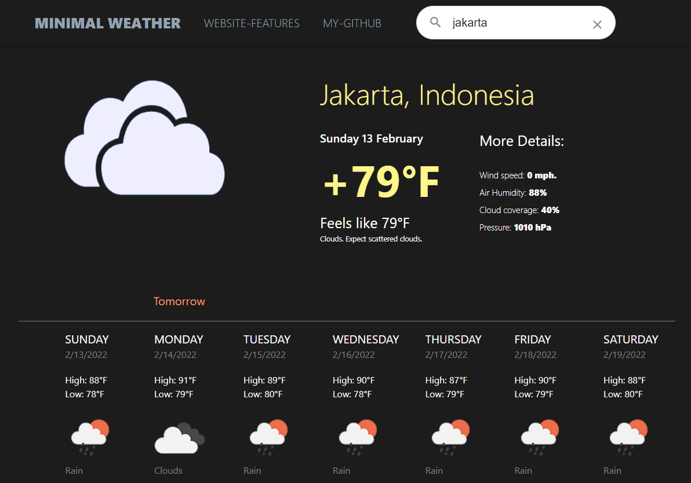
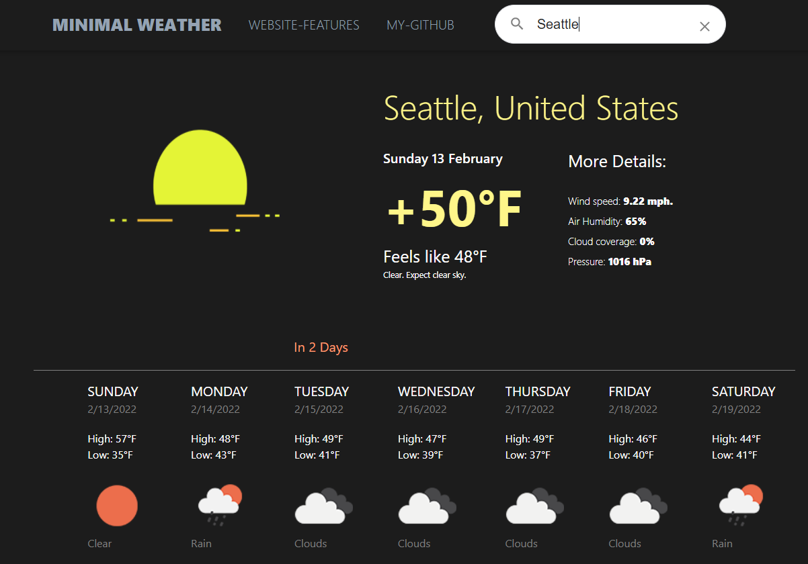
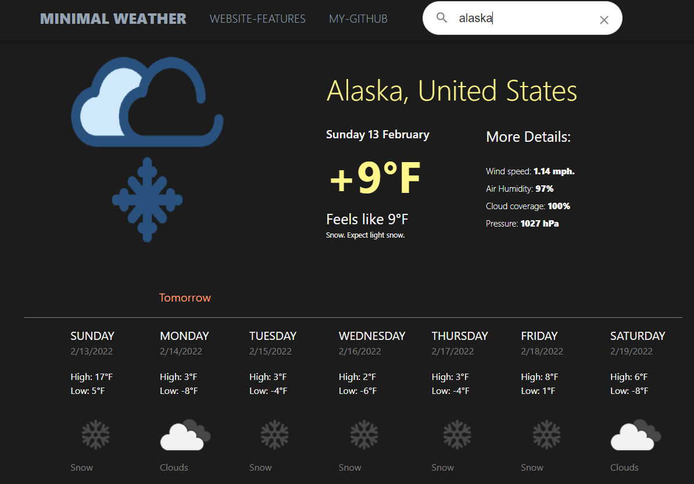
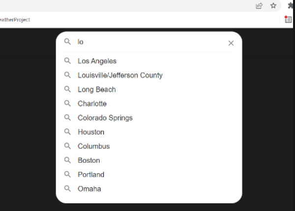

# Main Features of Minimal Weather.

## Changing Background Image.
- The background image changes to match the current weather in whichever city is being observed.

   
 

    

## Search Autocomplete Prediction.
- The Searchbar will predict and offer suggestions of the largest and most commonly searched for cities.

   
 
   

## Realtime API calls to OpenWeatherApi.
- Website provides simple way to get weather data on any city supported by OpenWeatherApi.

## Responsive UI
- The website will adjust and resize based on how large the browser window is.
- Mobile version of the website currently not available.
## Reactive UI
- Weather information and weather of all the days will respond to mouse interaction, making the website feel more responsive to use.
## Custom Built Design
- Background images, color scheme, and placement all custom designed.
